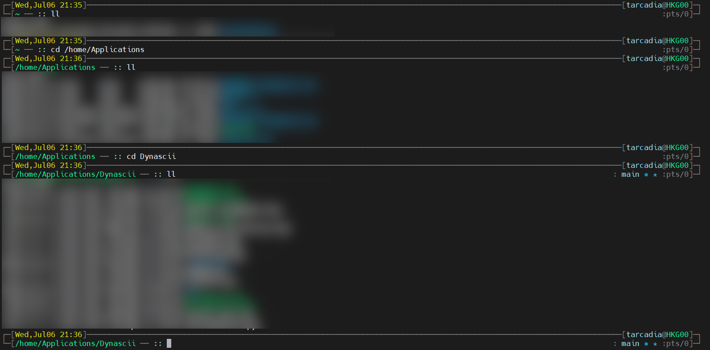

# What is this

This is a personal used zsh theme, a reversion from [Jonathan](https://github.com/ohmyzsh/ohmyzsh/blob/master/themes/jonathan.zsh-theme) in [Oh-My-Zsh](https://github.com/ohmyzsh/ohmyzsh). It did modification mainly on the layout and color of Jonathan, shifted the main color from cyan to grey, and move information to location more used to me personally.

I will appreciate it that you like this modification. This project follows MIT Licence as what Oh-My-Zsh follows. If there is any license violation I did not notice, please contact me.

# Preview

Here is a preview:

# How to use

Follow the commands below to add it to your oh-my-zsh themes

`$ wget https://raw.githubusercontent.com/tarcadia/tarcadia-zsh-theme/main/tarcadia.zsh-theme`

`$ mv tarcadia.zsh-theme ~/.oh-my-zsh/themes`
